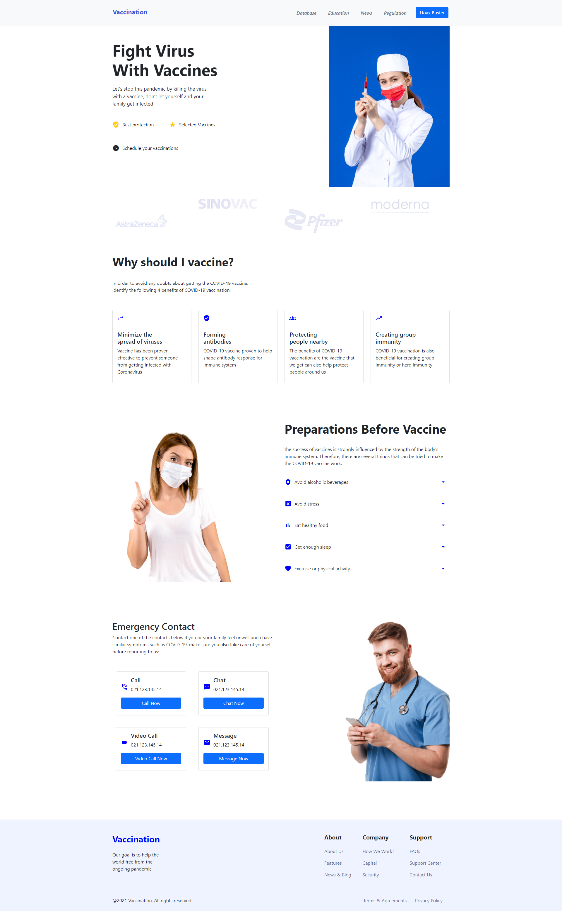

# Prácticade CSS

Descripción de la práctica:

* Maquetación del sitio con HTML
* Estilos con CSS (Lo más acercado posible, pueden ser otras imágenes, íconos o colores, pero tiene que ser lo más cercano que puedas)

## Resultado

### Landing page de ejemplo

